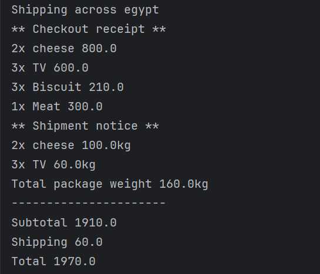
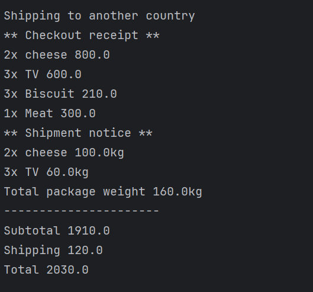
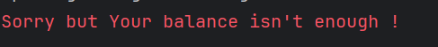
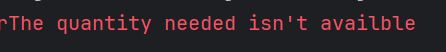

# 🛒 E-Commerce Checkout System (Java)

This project is a simple yet complete **object-oriented e-commerce system** written in Java. It supports features like product management, cart functionality, shipping logic, and checkout operations.

---

## 📦 Features

- ✅ Add products with name, price, and quantity
- 📅 Handle products that may expire (like Cheese, Biscuits)
- 🚚 Distinguish between shippable and non-shippable products
- 📥 Customers can:
  - Add items to cart
  - Checkout with subtotal, shipping fees, and total amount
  - Receive errors for empty cart, expired items, or insufficient balance
- 🧾 Print clear receipt and shipping summary

---
## 📸 Output

